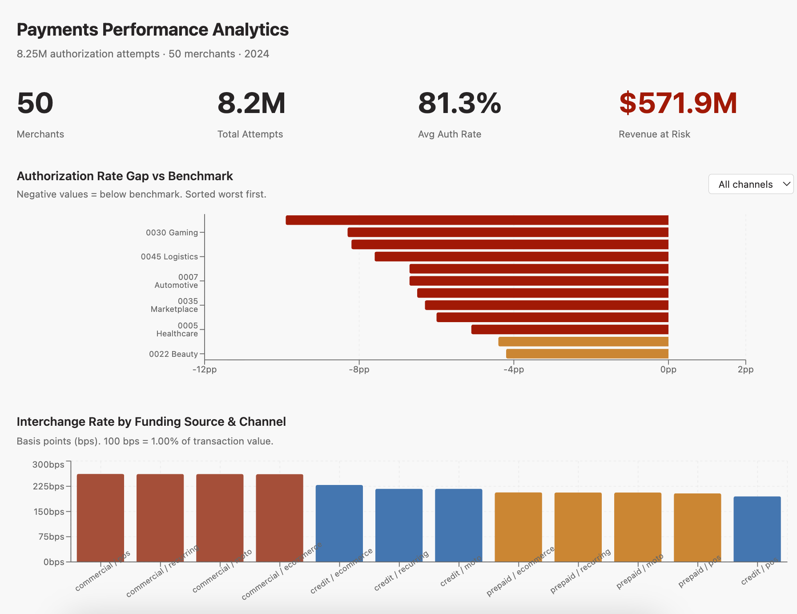

# Payments Performance Analytics Platform

**An end-to-end analytics engineering project transforming raw 
payment transaction events into merchant-facing optimization 
intelligence.**

---

## The Business Problem

Payment processors and merchants generate millions of 
authorization attempts every day. Without a structured data 
layer, the signals buried in that volume — why auth rates 
leak, which interchange tiers are avoidable, where fraud 
risk concentrates — stay invisible. Business teams are left 
making decisions from aggregate dashboards that cannot tell 
them which merchants, which channels, or which card segments 
to act on.

This platform models raw transaction events into a queryable, 
tested, and documented analytics layer that turns payment data 
into specific, quantified merchant recommendations.

---

## What This Project Demonstrates

- **End-to-end pipeline** — raw compressed NDJSON → DuckDB 
  raw table → dbt staging → intermediate → marts
- **Medallion architecture** — clear separation of concerns 
  at each layer with appropriate materialization strategies
- **Dimensional modeling** — star schema with fact and 
  dimension tables designed around authorization-grain data
- **dbt best practices** — column-level docs, schema tests, 
  generic and singular tests across all layers
- **Payments domain logic** — auth quality scoring, decline 
  classification, interchange tier assignment, and benchmark 
  gap calculations embedded in SQL
- **Recommendation layer** — prioritized, quantified 
  optimization opportunities per merchant, not just 
  descriptive aggregations
- **Scale** — 8.25M transactions across 50 dynamically 
  generated merchants across 15 verticals

---

## Business Questions This Platform Answers

1. **Auth rate leakage** — Which merchant segments have 
   authorization rates below vertical benchmarks, and what 
   is the estimated revenue impact of closing that gap?

2. **Interchange cost concentration** — Where are interchange 
   costs highest, and which combinations of funding source, 
   channel, and card type are driving above-benchmark 
   effective rates?

3. **Authentication data gaps** — Which transaction segments 
   lack sufficient CVC, AVS, or 3DS coverage, and what is 
   the risk exposure created by those gaps?

4. **Decline classification** — How are declines distributed 
   across hard, soft, and fraud categories? Which soft 
   declines are retryable?

5. **Token and 3DS adoption** — Where are network token and 
   3DS adoption gaps creating authorization rate drag and 
   cost optimization opportunities?

---

## Architecture
```
Raw NDJSON (S3 / cloud storage simulation)
│
▼
DuckDB raw table  ──  JSON unnesting, no transformation
│
▼
Staging  ──  Type casting, field renaming, deduplication
│
▼
Intermediate  ──  Payments domain logic and enrichment
│
▼
Marts  ──  Dimensional model, aggregations, benchmarks
│
▼
Optimization recommendations  ──  Quantified merchant actions
```

See [models/README.md](models/README.md) for full data model 
documentation and [docs/README.md](docs/README.md) for metric 
definitions and production architecture notes.

---

## Data Overview

| Attribute | Detail |
|---|---|
| Merchants | 50 dynamically generated across 15 verticals |
| Size tiers | Enterprise, large, mid, small |
| Volume | 8.25M authorization attempts |
| Period | 2024-01-01 to 2024-12-31 |
| Grain | One row per authorization attempt |
| Schema | Grounded in real payment processor API field structures |

Verticals: retail, QSR, subscription, healthcare, travel, 
marketplace, grocery, gaming, education, beauty, automotive, 
real estate, nonprofit, B2B SaaS, logistics.

---

## The Data — From Raw to Insight

### Raw Input — Bronze Layer

Each record arrives as a single compressed JSON blob — one row 
per authorization attempt stored in `raw.stripe_charges`. 
The raw layer ingests these without any transformation. 
56 fields per record covering transaction identity, card 
instrument, authorization checks, risk signals, and interchange 
economics. The table below shows 5 representative records — 
one clean POS authorization, one Apple Pay transaction, one 
decline, one ecommerce with missing CVC, and one disputed 
transaction. Scroll horizontally to see all 56 fields.

| id | charge_id | merchant_account_id | merchant_name | customer_id | attempt_number | created | created_at | card_brand | card_funding | card_country | card_last4 | card_exp_month | card_exp_year | card_fingerprint | card_network | card_wallet | card_bin | network_token_used | checks_cvc_check | checks_address_postal_code_check | checks_address_line1_check | three_d_secure_result | three_d_secure_version | three_d_secure_result_reason | outcome_network_status | outcome_type | outcome_risk_level | outcome_risk_score | outcome_reason | failure_code | outcome_network_decline_code | amount | amount_captured | currency | amount_usd_cents | billing_address_country | billing_address_postal_code | customer_email | customer_ip_country | device_type | shopper_interaction | is_guest_checkout | statement_descriptor | radar_risk_score | radar_risk_level | radar_outcome | disputed | dispute_reason | interchange_amount_cents | interchange_rate_bps | interchange_program | network_fee_cents | stripe_fee_cents | balance_transaction_id | settlement_date |
|:---|:---|:---|:---|:---|---:|---:|:---|:---|:---|:---|---:|---:|---:|:---|:---|:---|---:|:---|:---|:---|:---|:---|:---|:---|:---|:---|:---|---:|:---|:---|---:|---:|---:|:---|---:|:---|:---|:---|:---|:---|:---|:---|:---|---:|:---|:---|:---|:---|---:|---:|:---|---:|---:|:---|:---|
| pi_vCoj6YkBQraizYesFHtIjrez | ch_QM0LApaSLjuJTaKMZKh5ioaP | acct_beau000001 | Merchant_0001_Beauty | null | 1 | 1704070613 | 2024-01-01T00:56:53+00:00 | visa | debit | US | 5599 | 10 | 2028 | pNaF2up8SjUSF2N9 | visa | null | 49857374 | False | pass | pass | pass | null | null | null | approved_by_network | authorized | elevated | 73 | null | null | 00 | 5846 | 5846 | usd | 5846 | US | 98101 | null | US | pos_terminal | pos | True | BEAUTY1 | 81 | highest | review | False | null | 52 | 89 | REGULATED_DEBIT | 8 | 199 | txn_cuxplVxJ5zHBpL5il7Pqr0xl | 2024-01-02 |
| pi_eW7DF8mgupKtzh5KX1Sb5vkc | ch_HeuypsExD4BI8jbFXch0vwiI | acct_beau000001 | Merchant_0001_Beauty | null | 1 | 1704072758 | 2024-01-01T01:32:38+00:00 | visa | debit | GB | 7052 | 6 | 2027 | BJuO1yEeJbXcdSbR | visa | apple_pay | 45989189 | False | pass | unchecked | pass | null | null | null | approved_by_network | authorized | normal | 28 | null | null | 00 | 6312 | 6312 | usd | 6312 | GB | EC1A 1BB | null | GB | pos_terminal | pos | True | BEAUTY1 | 3 | normal | allow | False | null | 45 | 72 | SUPERMARKET | 8 | 213 | txn_sHfTQvHW5noaZKWbbvGUVST1 | 2024-01-02 |
| pi_gtxfufzmfhEFgkM355a5Si9r | null | acct_beau000001 | Merchant_0001_Beauty | null | 1 | 1704128312 | 2024-01-01T16:58:32+00:00 | mastercard | credit | US | 9696 | 5 | 2027 | 4T4QOc6zmwbKZFQ7 | mastercard | null | 55493235 | False | pass | pass | pass | null | null | null | declined_by_network | issuer_declined | normal | 3 | null | do_not_honor | 05 | 2060 | 0 | usd | 2060 | US | 33101 | null | US | pos_terminal | pos | True | BEAUTY1 | 68 | elevated | review | False | null | null | null | null | null | null | null | null |
| pi_uZo03LzftvUWfGY5HSdOz7Bm | ch_zd3ZLBLA2h0pV6OHpBEiEDxL | acct_reta000003 | Merchant_0003_Retail | null | 1 | 1704067644 | 2024-01-01T00:07:24+00:00 | visa | credit | GB | 9016 | 12 | 2026 | mwNNjVd6RluKjw0u | visa | null | 43950326 | False | null | unchecked | unchecked | exempted | 2.1.0 | null | approved_by_network | authorized | highest | 91 | null | null | 00 | 26467 | 26467 | usd | 26467 | GB | 1010 | null | GB | mobile | ecommerce | True | RETAIL3 | 70 | elevated | review | False | null | 531 | 201 | STD_IRF | 31 | 797 | txn_ISyKrqZlOfXve7e8qT97PVX6 | 2024-01-03 |
| pi_tvH9TP3ptPwafA5reVZbUXMk | ch_Ls2VNM3ND6ElrUNLoXkHFh0v | acct_beau000001 | Merchant_0001_Beauty | null | 1 | 1705644324 | 2024-01-19T06:05:24+00:00 | visa | debit | US | 5691 | 2 | 2026 | ChTcmXuMApNRkC4I | visa | apple_pay | 46172566 | False | pass | pass | pass | null | null | null | approved_by_network | authorized | elevated | 46 | null | null | 00 | 2486 | 2486 | usd | 2486 | US | 85001 | null | US | pos_terminal | pos | True | BEAUTY1 | 78 | highest | review | True | unrecognized | 20 | 83 | SUPERMARKET | 4 | 102 | txn_JJ3Ske2USh216ksmgbg3urpH | 2024-01-20 |

Key observations from this raw data:
- Row 3 (declined): `charge_id` is null, all interchange and fee 
  fields are null — no economics on failed transactions
- Row 4 (ecommerce, no CVC): `checks_cvc_check` is null — 
  merchant did not submit CVC. 3DS was exempted. Interchange 
  program is `STD_IRF` — the highest fallback tier, directly 
  caused by missing auth data
- Row 5 (disputed): Transaction authorized and settled normally, 
  but `disputed: True` and `dispute_reason: unrecognized` — 
  cardholder later contested the charge


### Gold Output — Optimization Recommendations

After raw → staging → intermediate → marts, the platform 
produces merchant-specific, quantified recommendations:

| merchant_name | recommendation_type | priority | affected_txns | annual_impact_usd | detail |
|:---|:---|:---|---:|---:|:---|
| Merchant_0047_Automotive | adopt_network_tokens | HIGH | 743,078 | $196.4M | High ecommerce/recurring volume not using network tokens |
| Merchant_0046_Realestate | improve_cvc_coverage | HIGH | 85,888 | $148.8M | High rate of transactions missing CVC data |
| Merchant_0008_Marketplace | adopt_network_tokens | HIGH | 721,936 | $59.6M | High ecommerce/recurring volume not using network tokens |
| Merchant_0046_Realestate | adopt_network_tokens | HIGH | 59,357 | $41.1M | High ecommerce/recurring volume not using network tokens |
| Merchant_0020_Automotive | adopt_network_tokens | HIGH | 165,986 | $30.7M | High ecommerce/recurring volume not using network tokens |
| Merchant_0047_Automotive | investigate_interchange_tier | MEDIUM | 178,403 | $29.5M | Significant volume qualifying at premium interchange tier |

The same raw transaction data that came in as JSON blobs 
comes out as specific, dollar-quantified actions a payments 
expert can walk into a merchant conversation with.

---

## Live Demo

| | |
|---|---|
| 📊 **Dashboard** | [Payments Performance Analytics](https://app.motherduck.com/dives/b88b73e6-c16e-4459-bd20-ed72e6b4ae3c) *(free MotherDuck account required)* |
| 📖 **Data Docs** | [dbt lineage + model documentation](https://jokonkwo.github.io/payments-performance-analytics-platform/) |
| 🗄️ **Query the data** | See [MotherDuck access](#motherduck-access) below |



---

## MotherDuck Access

Query the gold layer directly using DuckDB or MotherDuck 
(free account required):

```sql
ATTACH 'md:_share/payments_performance_jokonkwo/5ffa01f6-e26b-4e86-b999-79c010cdc71d';

-- Auth rate gaps by merchant and channel
SELECT 
    a.merchant_account_id,
    m.merchant_name,
    a.shopper_interaction,
    ROUND(AVG(a.auth_rate) * 100, 1) as avg_auth_rate_pct,
    ROUND(AVG(a.auth_rate_vs_benchmark) * 100, 1) as gap_vs_benchmark_pct,
    ROUND(SUM(a.potential_revenue_at_risk_cents) / 100.0, 0) 
        as revenue_at_risk_usd
FROM payments_performance.mart_auth_rate_performance a
JOIN payments_performance.dim_merchant m 
    ON a.merchant_account_id = m.merchant_account_id
GROUP BY 1, 2, 3
ORDER BY gap_vs_benchmark_pct ASC
LIMIT 15;
```

See [scripts/README.md](scripts/README.md) for the full list 
of available tables.

---

## Running Locally

See [scripts/README.md](scripts/README.md) for full setup 
instructions.

**Quick start:**
```bash
git clone https://github.com/jokonkwo/payments-performance-analytics-platform.git
cd payments-performance-analytics-platform
pip install -r requirements.txt
python scripts/generate_synthetic_data.py --num-merchants 50 --seed 42
python scripts/ingest_raw.py
dbt deps --profiles-dir .
dbt run --profiles-dir .
dbt test --profiles-dir .
```

---

## Data Disclaimer

Transaction data is synthetically generated to mirror real 
payment processor event schemas. Field names and structures 
are grounded in publicly documented payment processor APIs. 
Interchange rates are derived from published Visa and 
Mastercard interchange schedules, not proprietary fee data. 
This project is intended for portfolio and educational 
purposes.
